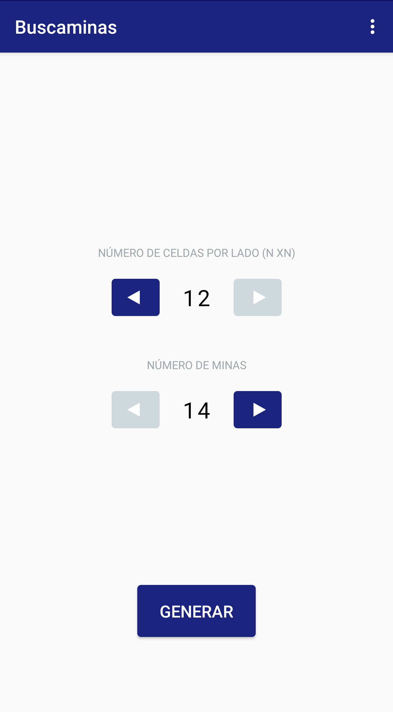
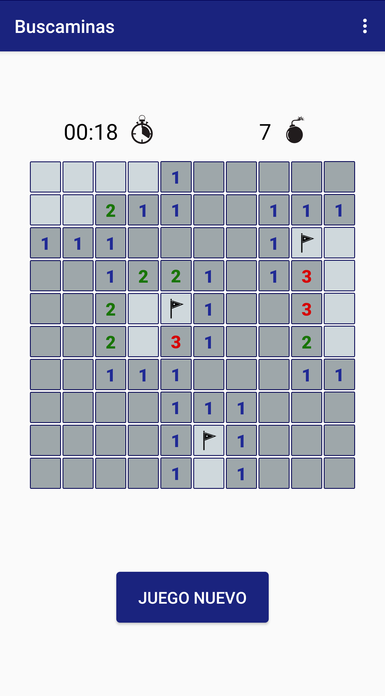
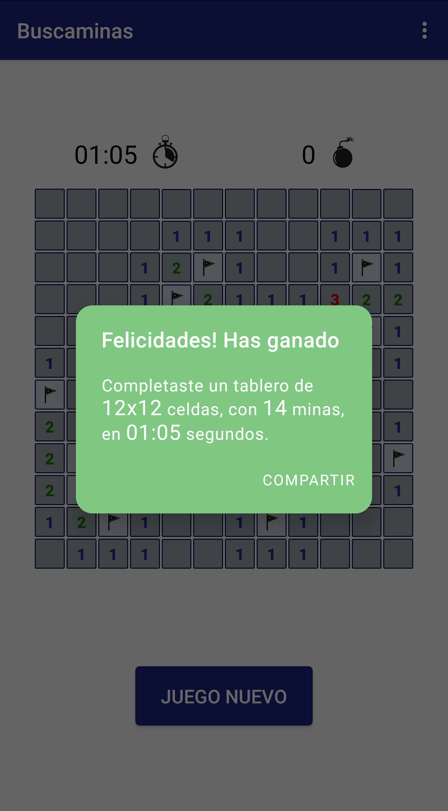

# :bomb: Buscaminas
The classic Minesweeper game. Now, on your phone.

Built with ❤︎ by [Jorge Ávila](https://www.linkedin.com/in/jorgeavilae/)
	
<a href='https://play.google.com/store/apps/details?id=com.jorgeav.buscaminas&pcampaignid=pcampaignidMKT-Other-global-all-co-prtnr-py-PartBadge-Mar2515-1'>
</a>


##  Usage
Create a new board setting the number of cells by side (N x N) and the number of mines on the board. 

Then, you just tap on each cell to reveal it. You can long-click on a cell where you think there is a mine, and the mines indicator will decrease. 

When all cells without mines are revealed, you can share your results with your friends and engage them to beat you. Time is ticking, so tap fast to be the best!.



## About The App
A native Android app, write in **Kotlin**, and publish in **Google Play Store** (https://play.google.com/store/apps/details?id=com.jorgeav.buscaminas)

This app is built based on **Clean Architecture** and **S.O.L.I.D.** principles. It has two modules:
* 	**core** for inner layers with business logic and framework independent (use cases, domain model and data abstractions). Without any android-related dependency in gradle file.
* 	**app** for external layers with framework dependent packages (user interface, dabatase and dependency injection)

Uses **Model-View-ViewModel** pattern with **LiveData** and **DataBinding** in the UI package.

Stores data in a **Room Database** and **SharedPreferences**, but encapsulates this behaviour under **Repository pattern**.

**Coroutines** are used for async tasks, such as load data.

Includes **Navigation Component** and a XML nav graph for navigate between Fragments.

Uses a **RecyclerView** in a grid format, with his Adapter and a **CompoundView** to simplify cells content depending on the cell's state (number, empty, bomb, marked, hide...)

Implements three types of animations: **AnimatorSet** for changes in numbers in 'new board' screen, **MotionLayout** when loads board from data and shows up, and **XML transitions** in the Navigation Component.

Gradle defines two **builds types**: debug and release. In the debug version, an external library [RoomExplorer](https://github.com/wajahatkarim3/RoomExplorer) is used to view the content in Room Database. 

Uses **[Dagger](https://dagger.dev/) for dependency injection**. Uses only one Singleton module, which provides some classes as interfaces and needs a Context external dependency to build.

## Contact
Jorge Ávila - [LinkedIn](https://www.linkedin.com/in/jorgeavilae/) - jorgeavilae@gmail.com

## License
```
Copyright 2020 Jorge Ávila

Licensed under the Apache License, Version 2.0 (the "License");
you may not use this file except in compliance with the License.
You may obtain a copy of the License at

   http://www.apache.org/licenses/LICENSE-2.0

Unless required by applicable law or agreed to in writing, software
distributed under the License is distributed on an "AS IS" BASIS,
WITHOUT WARRANTIES OR CONDITIONS OF ANY KIND, either express or implied.
See the License for the specific language governing permissions and
limitations under the License.
